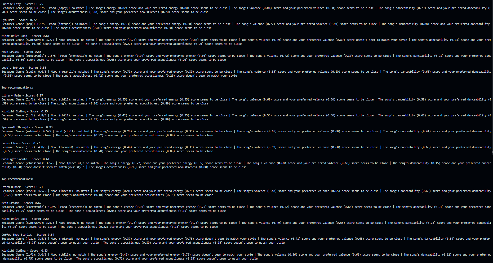

# 🎧 Model Card: Music Recommender Simulation

## 1. Model Name  

Give your model a short, descriptive name.  
Example: **VibeFinder 1.0**  
---

SakiYomi

## 2. Intended Use  

Describe what your recommender is designed to do and who it is for. 

Prompts:  

- What kind of recommendations does it generate  
- What assumptions does it make about the user  
- Is this for real users or classroom exploration  

---

The SakiYomi is a content-based music recommendation engine that helps users guide their music taste based on their "taste profile," which is curated based on the value of the genres they have for each category.     
(e.g if the genre is pop and its value is at a 4.5 out of 5, then the recommendation system will likely encourage the user to someone like Michael Jackson) 
So, as you can tell from this example, the assumption that this recommender will make about the user is that if a genre of a song is valued high, 
the recommender will interpret that as the user highly favoring that genre for all songs, even though the user may not like all songs in that genre. 
This is recommender is simply for classroom exploration and help me better understand the recommendation system that contemporary streaming platforms
employ
## 3. How the Model Works  

Explain your scoring approach in simple language.  

Prompts:  

- What features of each song are used (genre, energy, mood, etc.)  
- What user preferences are considered  
- How does the model turn those into a score  
- What changes did you make from the starter logic  

Avoid code here. Pretend you are explaining the idea to a friend who does not program.

---
    First, get the score of the genre
    Calculate the genre first (will be 40% of the score)
    Score the song's mood either a 1 or 0, mood matching is binary. It will also weigh 20% of the score. 
    Energy, valence, dance, and acoustic attributes will cover the remaining 40% being 10% each. 
    Lastly, combine all of the scores and round the value by 4 decimal places for an optimal rounded value.   

## 4. Data  

Describe the dataset the model uses.  

Prompts:  

- How many songs are in the catalog  
- What genres or moods are represented  
- Did you add or remove data  
- Are there parts of musical taste missing in the dataset  

---

The dataset includes a total of 18 songs that have a mix of 15 different genres and 12 different moods. 
No data was removed but 8 extra songs were added. Some notable musical tastes we could add are K-Pop and Dance. 

## 5. Strengths  

Where does your system seem to work well  

Prompts:  

- User types for which it gives reasonable results  
- Any patterns you think your scoring captures correctly  
- Cases where the recommendations matched your intuition  

---

So, because this recommendation system primarily targets the genre and mood, this algorithm will likely be able
to spot the overall picture of what a user's preference for their type of song and adequately recommend it. 

Naturally, I found that if I made the genre and mood about 60% of the weighed score, the song would likely
get placed into the top-k recommended even if the other scores did not have a close match to the user's preferences.

## 6. Limitations and Bias 

Where the system struggles or behaves unfairly. 

Prompts:  

- Features it does not consider  
- Genres or moods that are underrepresented  
- Cases where the system overfits to one preference  
- Ways the scoring might unintentionally favor some users  

---

Although this recommendation algorithm is broad in the sense that it can match the user's taste based on the 
genre and mood, but this algorithm does not handle cases where the user decides that the mood might be more important than the genre picked. It would be a good feature to handle flexibility in the weighs of the attributes rather than
just focusing on the genre. 

## 7. Evaluation  

How you checked whether the recommender behaved as expected. 

Prompts:  

- Which user profiles you tested  
- What you looked for in the recommendations  
- What surprised you  
- Any simple tests or comparisons you ran  

No need for numeric metrics unless you created some.

---

To check the behavior of the recommender so that it meets expectations, I've added 3 user taste profiles that have different preferences. 
As expected, the the more the genre and mood aligned, the higher the score was for that song. For example, one user profile had a 
preference for lofi and a chill mood, and the song "Library Rain" ended up scoring the highest (0.97) because of those closely 
matched preferences along with the other attributes. However, for another user's top pick, "Sunrise City," the song genre had a strong match but not the 
mood, lowering the score, which is also an expected outcome given the 20% weight of the mood.
 

## 8. Future Work  

Ideas for how you would improve the model next.  

Prompts:  

- Additional features or preferences  
- Better ways to explain recommendations  
- Improving diversity among the top results  
- Handling more complex user tastes  

---

The primary way that this algorithm may be improved is giving the user the autonomy to choose which preferences they want 
to prioritize most, allowing for a user-algorithm combined approach. 

We could also format the recommendation explanations to make it more user-friendly and more descriptive if this were ever to be shown
on a client-faced website for example.

## 9. Personal Reflection  

A few sentences about your experience.  

Prompts:  

- What you learned about recommender systems  
- Something unexpected or interesting you discovered  
- How this changed the way you think about music recommendation apps  

I learned that recommender systems are more verbose than I initially thought and that there are a lot of variables to think of 
when designing one from scratch. Additionally, after doing research and implementing a music recommendation algorithm, I can 
now deeply appreciate how these enterprise streaming companies are making novel ways to read the mind's of the user.  